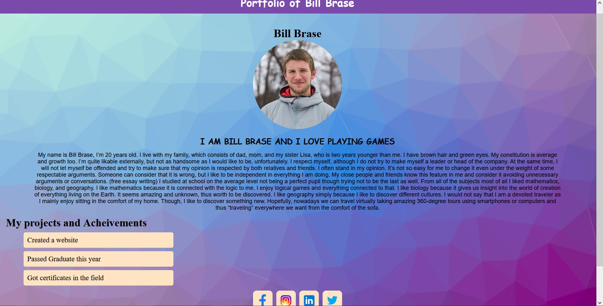

# Introduction to HTML and CSS

This is repository for session to introduction to HTML and CSS.

## What we will be creating?

  

---

## Getting Started:

### Clone this repo 
Clone this repositories to get started with starting assets.

1. Create html at first
2. Try adding Css to make it beautiful.
